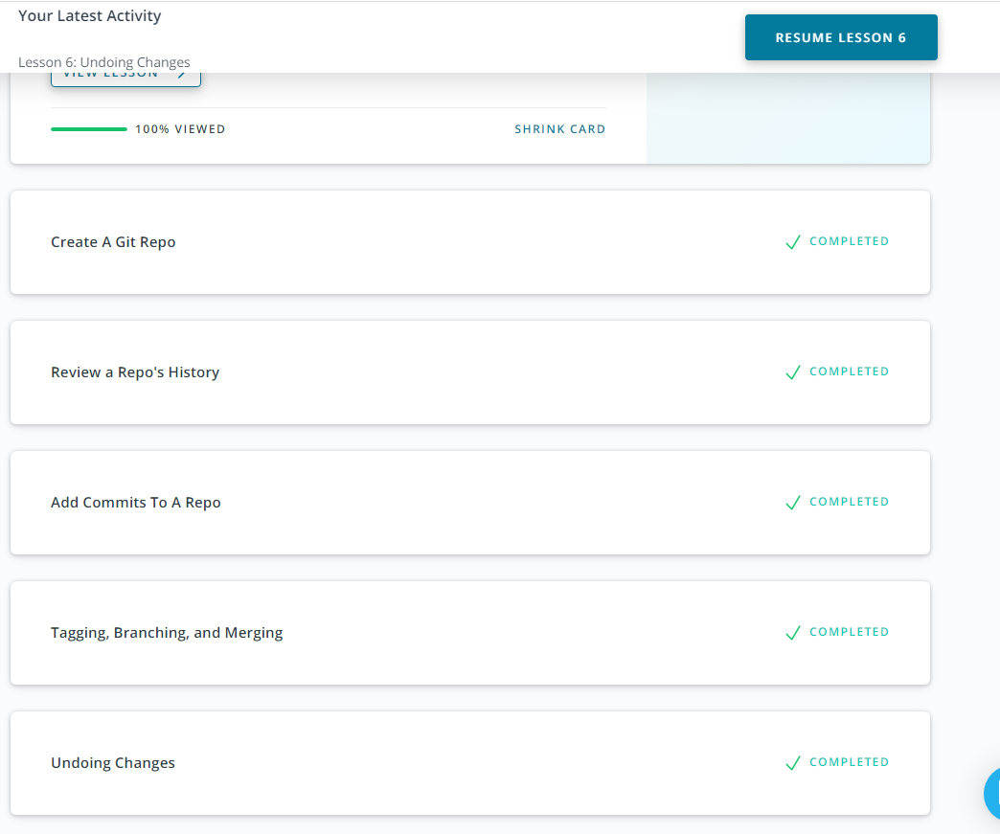

# kottans-frontend

## General
 0. [Git Basics](tasks/git_start.md)
 1. [Linux CLI and Networking](tasks/linux_cli.md)
 2. [VCS (hello gitty), GitHub and Collaboration](tasks/git_collaboration.md)

### Git and Github
I've learned about using version control system Git: 
* Create a repo
* Commit changes
* Review the history of commits
* Work with branches
* Undo mistakes

