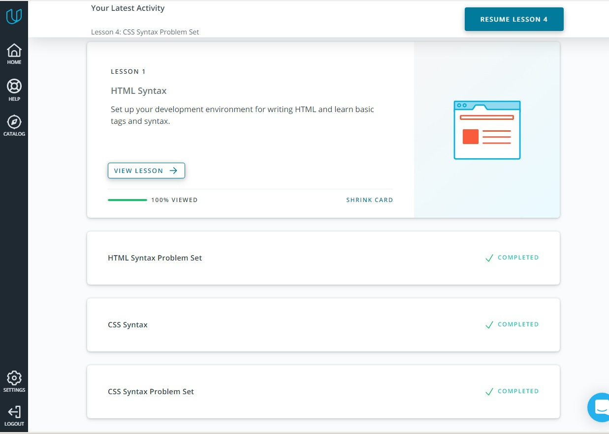

# kottans-frontend

### General
 0. [Git Basics](#git-and-github)
 1. [Linux CLI and HTTP](#linux-cli)
 2. [GitHub and Collaboration](#git-сollaboration)

### Front-End Basics
 3. [Intro to HTML & CSS](#intro-html-css)

## Git and Github
I've learned about using version control system Git: 
* Create a repo
* Commit changes
* Review the history of commits
* Work with branches
* Undo mistakes

## Linux CLI and HTTP
I've learned about using command Linux: 
* Directory structure
* Work with files
* Security
* Output files
* Disk space and processes

## Git Collaboration
I've learned about work with remote repository, push, pull, fetch.

## Intro to HTML & CSS
I've refreshed my information about HTML and CSS, I knew many things before, learned a little new about transition in CSS.

